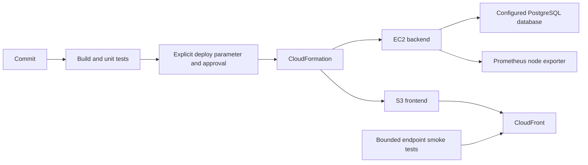

# Udapeople: AWS delivery pipeline

A Udacity Cloud DevOps case study for delivering a React frontend and NestJS backend with CircleCI, CloudFormation and Ansible. This is the canonical project; the earlier [udapeople-cicd variant](https://github.com/stevegod01/udapeople-cicd) is retained as historical reference.

The application and original project structure come from [Udacity's CI/CD starter](https://github.com/udacity/cdond-c3-projectstarter). This fork extends the deployment, configuration, monitoring and cleanup exercise. [Consolidation record](docs/CONSOLIDATION.md) identifies all preserved variant differences and original commits.

## Architecture and stages



The cloud workflow provisions workflow-specific frontend/backend stacks, configures the server, applies database migrations, deploys application artifacts, probes backend/frontend endpoints, switches the CloudFront origin, and removes the validated previous environment.

**Normal pushes run checks only.** CircleCI's deploy parameter defaults to false, and its deployment workflow also requires approval. [GitHub Actions](.github/workflows/validate.yml) runs offline configuration/helper checks plus frontend/backend unit tests and builds on Node.js 24.16.0. The inherited workflow that opened Udacity Jira tickets was moved to [historical documentation](docs/legacy/udacity-jira-workflow.yml), where it cannot run.

## Local verification

Tested on Node.js 24.16.0 and Python 3.12.14. The application still uses historical React/NestJS/Webpack dependencies; this cleanup makes the existing build reproducible and does not claim a complete dependency modernization.

```bash
python -m pip install -r requirements-checks.txt
python scripts/validate_config.py
python -m unittest discover -s tests -v

cd backend
npm ci --ignore-scripts --legacy-peer-deps
npm run build
npm test -- --runInBand --coverage=false
cd ../frontend
npm ci --ignore-scripts --legacy-peer-deps
export NODE_OPTIONS=--openssl-legacy-provider
export API_URL=http://127.0.0.1:3030
npm run build
npm test -- --runInBand --coverage=false
```

The OpenSSL compatibility option is required by the retained Webpack 4 build. Tests use mocks; these commands do not require AWS credentials or a running database. The backend's separate end-to-end tests are not included in the unit-test result.

Local results on 18 September 2026:

| Check | Result |
|---|---|
| Backend unit tests | 79 tests passed across 51 suites |
| Frontend unit tests | 12 tests passed across 5 suites |
| Backend and frontend builds | Passed |
| Endpoint retry/validation tests | 5 passed; network responses mocked |
| YAML and deployment-gate validation | Passed |

These are local results, not a claim of a new cloud deployment or a remote CI pass.

## Deployment is opt-in

Read [the operator runbook](docs/DEPLOYMENT.md) before setting deploy=true. Cloud resources incur charges, and the historical application dependency stack still requires modernization before a production service. Current database state, account policies, AMI availability and external service credentials are not established by this repository.

The repair removes public key-value-service migration coordination, stops dependency mutation during scans, uses bounded HTTP probes, prevents unrelated PM2 processes from being stopped, and restricts cleanup to a validated prior workflow ID. Database migration reversal requires operator review; do not assume application rollback restores data.

## Evidence and layout

- [Review assets](Review/): historical screenshots, demonstration video and presentation, preserved as course evidence.
- [.circleci/config.yml](.circleci/config.yml): validation workflow and opt-in delivery workflow.
- [.circleci/ansible](.circleci/ansible): scoped host configuration and application restart.
- [.circleci/files](.circleci/files): backend, frontend and CDN templates.
- [scripts](scripts/): offline validator and bounded endpoint checks.
- [Original pipeline](docs/legacy/circleci-before-cleanup.yml): pre-cleanup configuration, inactive.
- [Change report](CHANGE_REPORT.md): exact changes, tests and remaining limits.

The course license is preserved in [LICENSE.md](LICENSE.md). Existing media describe historical results; no current live URL or uptime claim is implied.

## Consolidated learning material

See [CI/CD labs](labs/README.md) and [historical contribution evidence](docs/contributions/todoassistant/README.md). Their provenance and limits are recorded separately from the Udapeople application.
